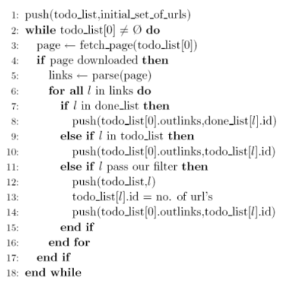

# Ejercicio 2

Modifique su programa anterior para implementar un crawler básico de acuerdo al algoritmo presentado en la siguiente figura



Luego, realice una pequeña recolección con los siguientes parámetros:

* a) Conjunto semilla: los 20 primeros sitios del ranking de Netcraft
* b) Cantidad Máxima de Páginas por sitio: [20-50]
* c) Profundidad Lógica Máxima: 3
* d) Profundidad Física Máxima: 3

Luego de la descarga, arme el grafo correspondiente. Grafique utilizando la librería pyvis

## Ejecucion

```bash
python TP5/EJ2/EJ2.py
```