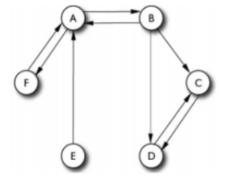

# Ejercicio 3

Realice un crawling de la página principal de Amazon.com (solamente páginas dentro del dominio). Al finalizar, analice la distribución de páginas dinámicas y estáticas y la distribución de frecuencias por profundidad lógica y física.

| Pos | Doc | Score |
| --- | --- | --- |
| 1   | E   | 4.9734 |
| 2   | C   | 4.8173 |
| 3   | A   | 2.5617 |
| 4   | B   | 2.0110 |
| 5   | D   | 0.8937 |
| 6   | F   | 0.0000 |

Las páginas se encuentran vinculadas de acuerdo al siguiente grafo:

* a) Calcule los valores de PageRank de las páginas utilizando como factor de damp 0.15 y 0.5. Pruebe iterando 2, 5 y 10 veces.
* b) Use los valores de PageRank para re-rankear la salida de la búsqueda interpolando los valores (controlado por un parámetro α). ¿Se altera el ranking? ¿En qué caso? Comente los resultados.

